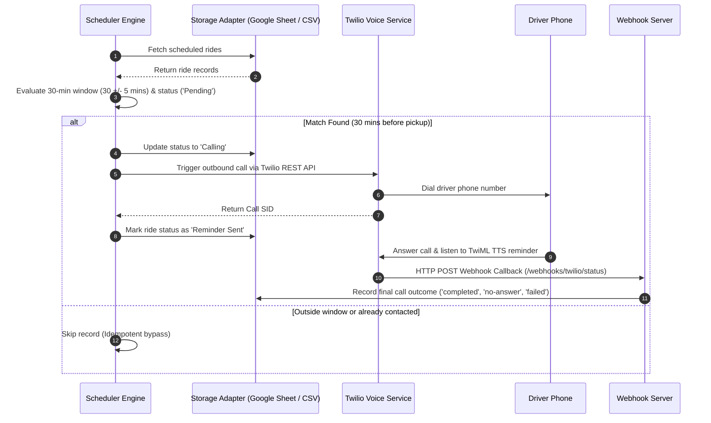

# Cabie Driver Pickup Reminder Agent

[](https://www.python.org/)
[](https://fastapi.tiangolo.com/)
[](https://www.twilio.com/docs/voice)
[](tests/)
[](LICENSE)
[](https://github.com/psf/black)

An automated fleet management service that monitors scheduled ride data, identifies upcoming pickups within a 30-minute lead window, dispatches automated Text-to-Speech (TTS) voice reminders to drivers via Twilio, and records call telemetry for operational auditability.

---

## System Overview

Driver punctuality and pre-trip customer confirmation are critical metrics in fleet operations. This agent automates dispatcher follow-ups by evaluating scheduled rides and executing automated voice calls 30 minutes prior to pickup time.

### Automated Driver Instructions:
1. **Confirm Pickup Details**: Contact or message the customer to verify trip details.
2. **Timely Departure**: Depart for the pickup location immediately to ensure on-time arrival.

---

## Architecture Sequence



---

## Quick Start & Installation

### Prerequisites
- Python 3.10+
- `pip` package manager

### 1. Installation
```bash
git clone https://github.com/SamirXR/Mr-Cabie-Assesment.git
cd Mr-Cabie-Assesment
pip install -r requirements.txt
```

### 2. Environment Configuration (`.env`)
```env
DATA_SOURCE=csv
CSV_FILE_PATH=sample_rides.csv
EXCEL_FILE_PATH=google_sheet.xlsx
TWILIO_PROVIDER=mock
PUBLIC_WEBHOOK_URL=http://localhost:8000
TIMEZONE=Asia/Kolkata
```

---

## Operational Execution Modes

Run the application using the unified `main.py` entry point:

```bash
# 1. Interactive Operations Web Dashboard (http://localhost:8000)
python main.py dashboard

# 2. Single Lead-Window Scan (Reference Time HH:MM)
python main.py scan --simulated-time 09:45

# 3. Continuous Background Daemon
python main.py daemon --interval 60

# 4. Manual Single-Ride Test Call
python main.py test-call --ride-id RIDE-104

# 5. Reset All Ride Statuses to Pending
python main.py reset
```

---

## Project Structure

```
Cabie_assesment/
├── config.py                 # Application settings & environment loader
├── main.py                   # Unified CLI entry point
├── google_sheet.xlsx         # Indian Delhi NCR reference Google Sheet dataset
├── sample_rides.csv          # Fallback CSV dataset
├── src/
│   ├── models.py             # Pydantic ride & telemetry models
│   ├── scheduler.py          # 30-min lead window scanning engine
│   ├── sheet_adapter.py      # Abstracted storage adapters (Google Sheet, XLSX, CSV, Mock)
│   ├── twilio_adapter.py     # Twilio Voice REST API & TwiML generator
│   └── twiml_server.py       # FastAPI dashboard & webhook callback server
├── dashboard/                # Executive monochrome Web UI
└── tests/                    # Automated pytest test suite
```

---

## API & Webhook Endpoints

| Endpoint | Method | Description |
| :--- | :--- | :--- |
| `GET /` | `GET` | Executive Web Operations Dashboard UI |
| `GET /api/rides` | `GET` | Fetch all scheduled ride records |
| `POST /api/scan` | `POST` | Execute 30-min scan (`{ "reference_time": "HH:MM" }`) |
| `POST /api/call/{ride_id}` | `POST` | Dispatch manual reminder call |
| `POST /api/reset` | `POST` | Reset all ride statuses to `Pending` |
| `POST /webhooks/twilio/status` | `POST` | Twilio call telemetry callback (`completed`, `no-answer`) |

---

## Verification & Test Suite

Run unit and integration tests:

```bash
pytest -v
```

### Test Suite Summary (5/5 Passing):
- `test_is_ride_in_window`: Validates exact 30-minute timing window logic (`30 +/- 5` mins).
- `test_scan_and_trigger_reminders_and_idempotency`: Verifies call triggers & duplicate call prevention.
- `test_unanswered_call_logging`: Confirms `no-answer` and `failed` status logging.
- `test_csv_sheet_adapter_read_write`: Validates CSV and XLSX dataset parsing.
- `test_generate_reminder_twiml`: Tests TwiML XML structure and TTS instructions.

---

## Production Roadmap (v2 Specification)

- **Interactive IVR (`<Gather>`)**: Allow drivers to press `1` to confirm or `2` to request dispatcher assistance.
- **Dispatcher Escalation**: Trigger automated Slack/SMS alerts to fleet managers if a driver call goes unanswered 20 minutes prior to pickup.
- **Dynamic GPS Lead Times**: Adjust reminder timing based on real-time traffic telemetry.
- **Multi-Channel Fallbacks**: Send automated WhatsApp or SMS reminders if outbound voice calls fail.
